<div align="center">
  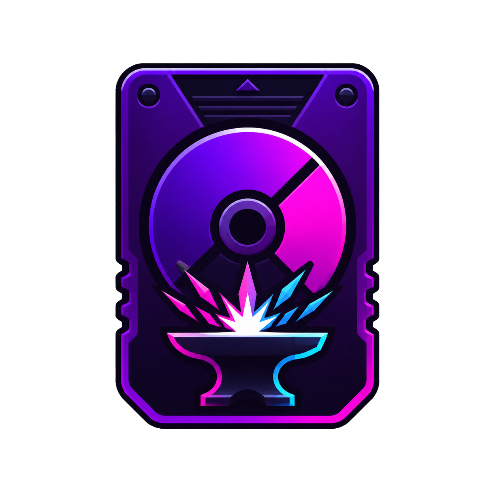

# OPL Forge

## Feature 006 highlights

- Existing OPL `ART/` covers are indexed once and rendered through the confined `opl-art:` protocol instead of `file://`.
- Downloads can target either an OPL device or an authorized folder on this computer; local results preserve their original format and are never launched automatically.
- Batch imports and downloads remain visible in the Activity Drawer with persisted progress and safe cancellation.
- Settings exposes manual and policy-controlled update checks. Download/install use only the trusted packaged provider and restart always requires explicit confirmation.
- The embedded SMB1 compatibility profile targets OPL's share-level/OEM flow: password authentication occurs at tree connect, with `OPEN_ANDX` and 64-bit reads supported. SMB1 should only be exposed on a trusted local network.

Release maintainers should follow [docs/releasing.md](docs/releasing.md). Hardware and platform gates are recorded in [Feature 006 validation results](specs/006-release-hardening-library-experience/validation-results.md).

**Prepare, organize e mantenha seu dispositivo do Open PS2 Loader em um só lugar.**

Uma aplicação desktop para importar jogos, estruturar dispositivos USB, gerenciar artes,
validar a biblioteca e acompanhar cada operação com segurança.

[](https://github.com/theguitarvity/src-app-oplforge/actions/workflows/ci.yml)


</div>

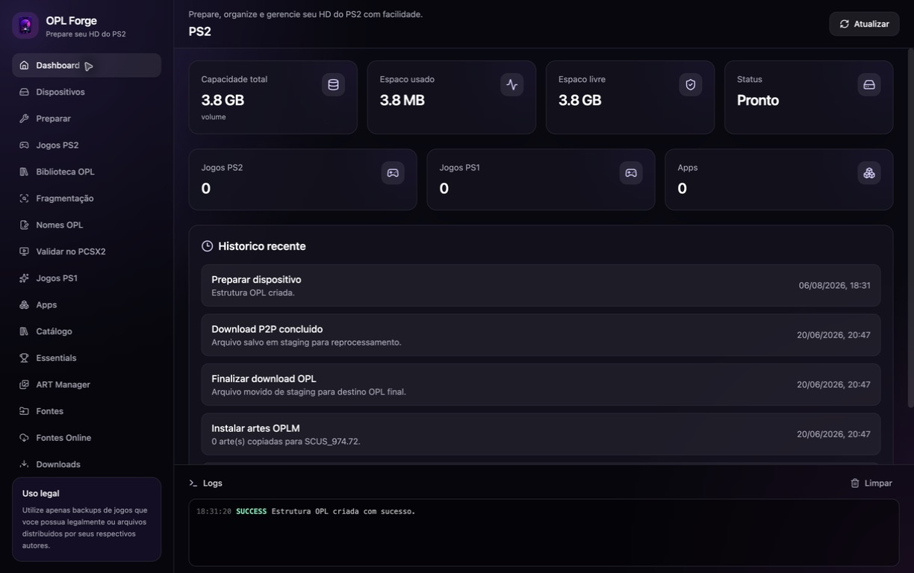

> [!IMPORTANT]
> O OPL Forge não fornece jogos nem incentiva pirataria. Use somente backups de mídias que você possui legalmente e arquivos distribuídos ou autorizados por seus respectivos autores.

## Sobre o projeto

Preparar um HD ou pendrive para o Open PS2 Loader normalmente exige várias ferramentas, convenções de nomes e verificações manuais. O OPL Forge reúne esse fluxo em uma interface desktop para Windows, macOS e Linux.

Com ele, você pode preparar a estrutura esperada pelo OPL, importar jogos de PS2 e PS1, instalar homebrews, organizar artes, corrigir nomes e fragmentação, validar a biblioteca no PCSX2 e acompanhar downloads e operações persistentes.

## Principais recursos

- **Preparação de dispositivos:** cria as pastas `DVD`, `CD`, `PS1`, `APPS`, `ART`, `CFG` e `VMC` esperadas pelo OPL.
- **Biblioteca PS2 e PS1:** importa arquivos individuais ou em lote, detecta Game ID e mantém um catálogo local.
- **Compatibilidade com FAT32/USBExtreme:** planeja a instalação, valida hashes e identifica fragmentação antes da finalização.
- **Diagnóstico e reparo:** audita nomes, organização e fragmentação com operações recuperáveis.
- **ART Manager:** indexa pacotes OPLM e sincroniza capas e outros tipos de arte com o dispositivo.
- **Catálogo e fontes:** reúne fontes locais e remotas configuradas pelo usuário, com seleção explícita dos arquivos.
- **Downloads resilientes:** usa fila persistente, staging, retomada e um único writer por dispositivo.
- **Validação com PCSX2:** auxilia na verificação da biblioteca antes de levá-la ao console.
- **Histórico e observabilidade:** exibe progresso, logs e histórico das operações realizadas.
- **Compartilhamento de rede (SMB/FTP):** permite que o PS2 navegue e lance jogos diretamente pela rede, sem precisar mover a unidade USB/HD entre o PC e o console.

## Screenshots

<table>
  <tr>
    <td width="50%">
      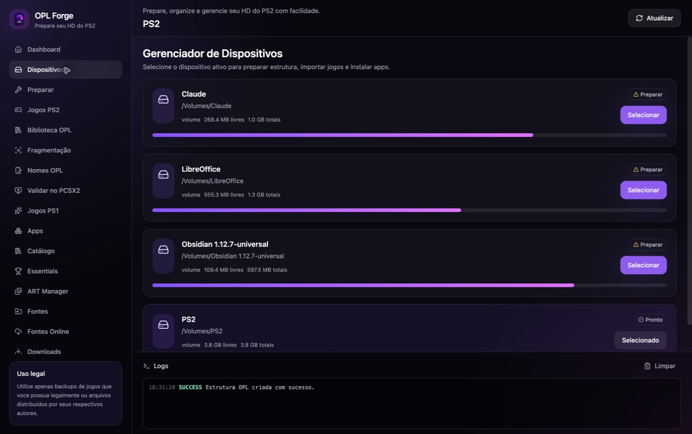
      <p align="center"><strong>Detecção e seleção de dispositivos</strong></p>
    </td>
    <td width="50%">
      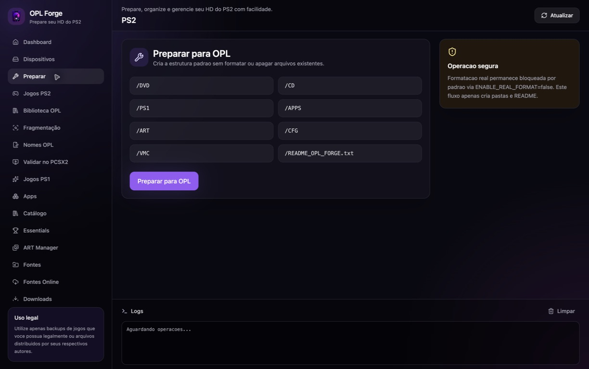
      <p align="center"><strong>Preparação segura da estrutura OPL</strong></p>
    </td>
  </tr>
  <tr>
    <td width="50%">
      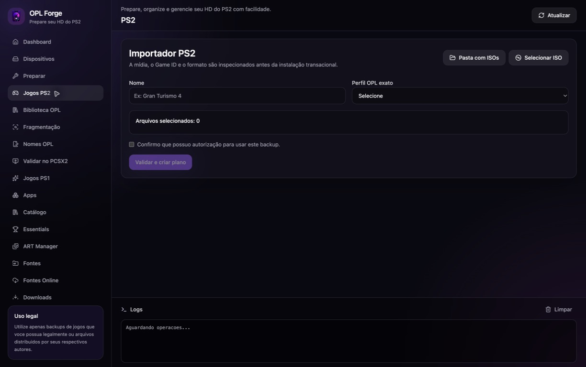
      <p align="center"><strong>Importação e validação de jogos PS2</strong></p>
    </td>
    <td width="50%">
      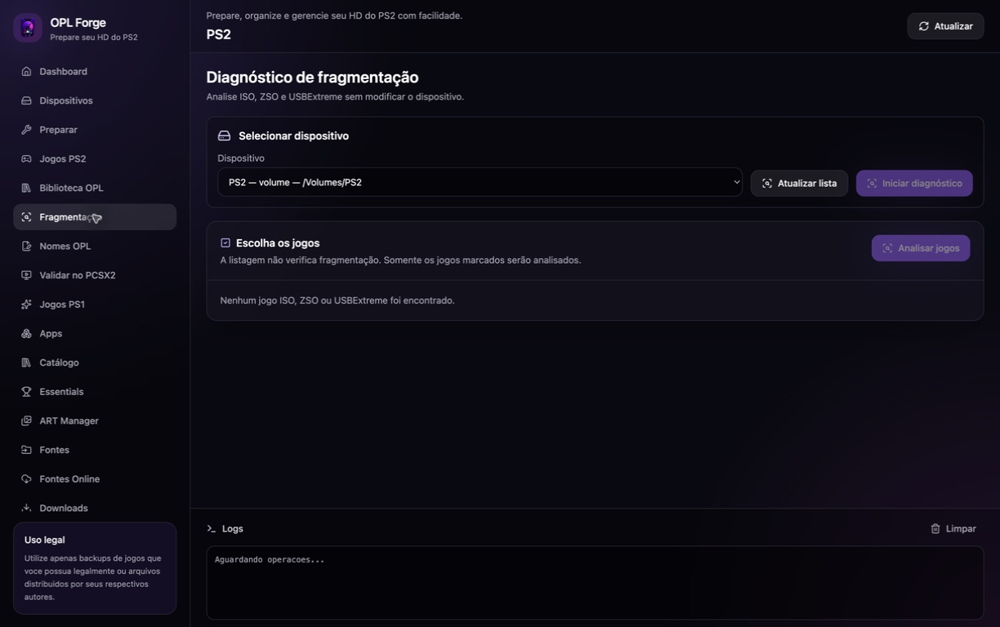
      <p align="center"><strong>Diagnóstico de fragmentação</strong></p>
    </td>
  </tr>
  <tr>
    <td width="50%">
      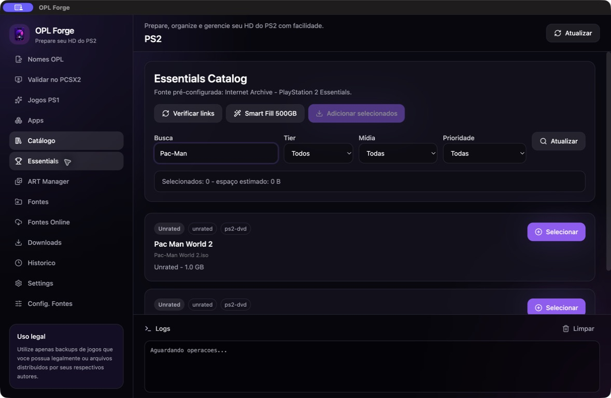
      <p align="center"><strong>Catálogo Essentials com busca e seleção</strong></p>
    </td>
    <td width="50%">
      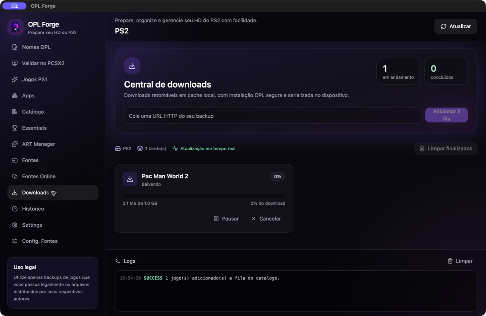
      <p align="center"><strong>Fila persistente com progresso em tempo real</strong></p>
    </td>
  </tr>
  <tr>
    <td width="50%">
      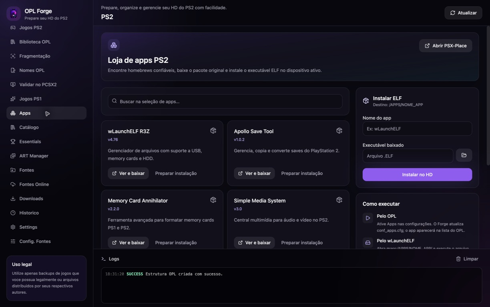
      <p align="center"><strong>Homebrews e instalação de ELF</strong></p>
    </td>
    <td width="50%">
      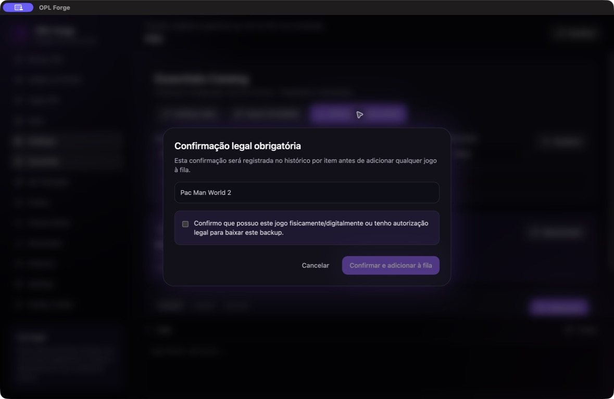
      <p align="center"><strong>Confirmação legal explícita por jogo</strong></p>
    </td>
  </tr>
</table>

> As capturas foram feitas com um dispositivo real chamado `PS2`. A estrutura OPL foi criada sem formatação ou remoção de arquivos e o fluxo do Essentials foi exercitado com um backup autorizado de Pac-Man World 2.

## App Mobile (Android)

Um app companion para Android usa a mesma biblioteca (via SAF — Storage Access Framework, sem exigir acesso root ao dispositivo de bloco) para catalogar, compartilhar via SMB com o PS2, rodar diagnóstico e baixar jogos do Catálogo Essentials direto do celular. O visual segue a mesma identidade "Forge Dark" do app desktop.

<table>
  <tr>
    <td width="50%">
      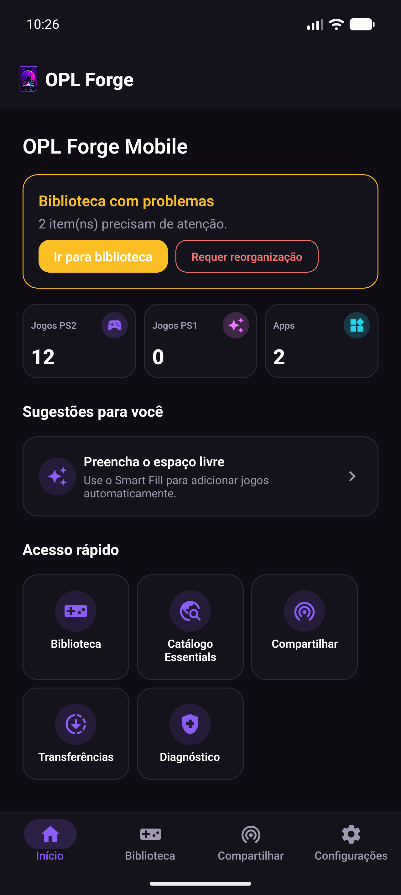
      <p align="center"><strong>Home com atalhos, contadores e sugestões</strong></p>
    </td>
    <td width="50%">
      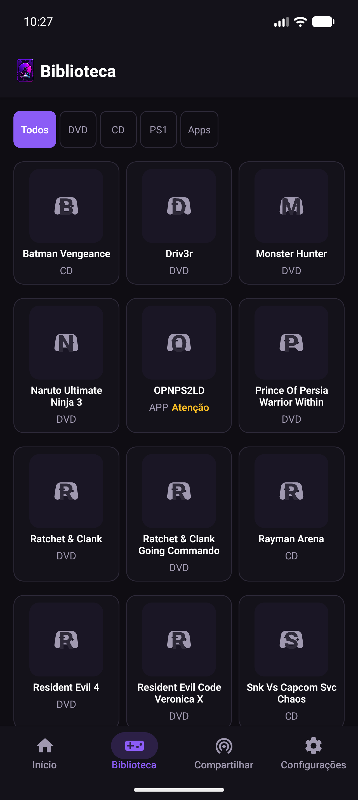
      <p align="center"><strong>Biblioteca em grade com filtros</strong></p>
    </td>
  </tr>
  <tr>
    <td width="50%">
      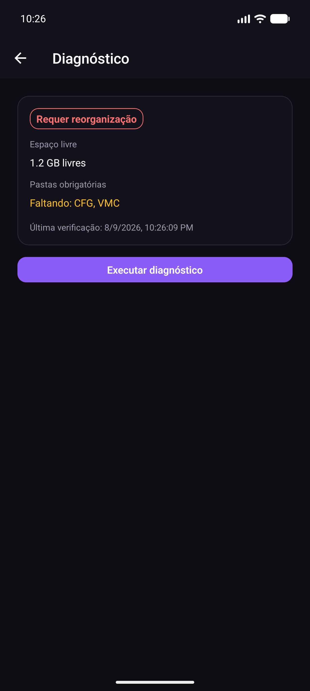
      <p align="center"><strong>Diagnóstico de prontidão da biblioteca</strong></p>
    </td>
    <td width="50%">
      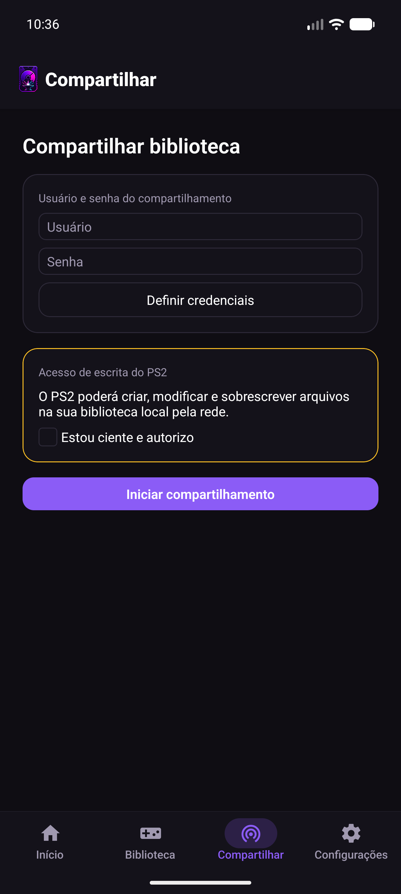
      <p align="center"><strong>Compartilhamento SMB com o PS2</strong></p>
    </td>
  </tr>
  <tr>
    <td width="50%">
      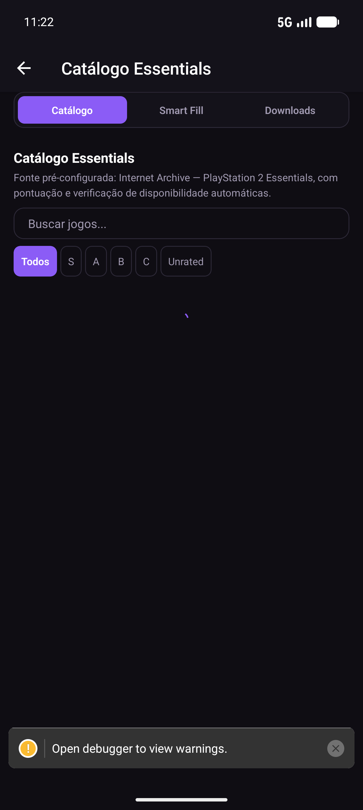
      <p align="center"><strong>Catálogo Essentials — abas Catálogo/Smart Fill/Downloads, filtros por tier</strong></p>
    </td>
    <td width="50%"></td>
  </tr>
</table>

> As capturas foram feitas em um emulador Android usando os nomes reais de um HD USB de backup do PS2 (Ratchet & Clank, Resident Evil 4, Tekken 5, Driv3r, Monster Hunter e outros) — apenas os nomes dos arquivos foram usados para popular a biblioteca de teste, sem copiar o conteúdo das mídias.

Baixe o APK mais recente (build contínua, debug-signed) em [Releases → continuous](https://github.com/theguitarvity/src-app-oplforge/releases/tag/continuous) ou no [portal de downloads](https://theguitarvity.github.io/src-app-oplforge/).

## Requisitos

Antes de começar, instale:

- [Node.js 22 LTS](https://nodejs.org/)
- [pnpm 9 ou superior](https://pnpm.io/installation)
- Git

O Electron e as demais dependências são instalados pelo próprio projeto.

## Início rápido

```bash
git clone https://github.com/theguitarvity/src-app-oplforge.git
cd src-app-oplforge
corepack enable
pnpm install
pnpm electron:dev
```

Se você usa `nvm`, o repositório já informa a versão correta do Node:

```bash
nvm install
nvm use
```

## Como usar

1. **Conecte o dispositivo** USB ou HD externo que será usado pelo OPL.
2. Abra **Dispositivos**, atualize a lista e selecione a unidade correta.
3. Em **Preparar**, confira o plano antes de criar a estrutura de diretórios.
4. Use **Jogos PS2**, **Jogos PS1** ou **Apps** para adicionar seu conteúdo autorizado.
5. Revise a biblioteca em **Nomes OPL**, **Fragmentação** e **Validar no PCSX2**.
6. Use o **ART Manager** para sincronizar capas e outros recursos visuais.
7. Acompanhe o andamento em **Downloads**, **Histórico** e no painel de logs.
8. Ejete o dispositivo com segurança antes de conectá-lo ao PlayStation 2.

### Limpar históricos

- Em **Downloads**, selecione **Limpar finalizados** e confirme em **Limpar registros**. Somente tarefas concluídas, canceladas ou com falha saem da lista; transferências ativas e jogos instalados não são alterados.
- Em **Histórico**, selecione **Limpar histórico** para apagar os registros locais de operações. Essa ação não remove arquivos do dispositivo.

### Formatos e destinos

| Conteúdo                       | Formatos principais                | Destino sugerido      |
| ------------------------------ | ---------------------------------- | --------------------- |
| Jogos PS2                      | `.iso`                             | `/DVD` ou `/CD`       |
| Jogos PS1                      | `.bin`, `.cue`, `.iso`             | `/PS1`                |
| Apps e homebrews               | pasta do aplicativo                | `/APPS/NOME_APP`      |
| Artes OPLM                     | COV, COV2, LAB, ICO, SCR, BG e LGO | `/ART`                |
| Arquivos ainda não finalizados | arquivos baixados ou compactados   | `/_OPL_FORGE_STAGING` |

> [!CAUTION]
> Sempre confirme o caminho e o dispositivo selecionado antes de preparar, reorganizar ou reparar uma unidade. Mantenha backup dos arquivos importantes.

## Compartilhamento de rede (SMB/FTP)

Em **Configurações → Rede**, você pode ligar um compartilhamento local para que o PS2 (rodando OPL, modo ETH) navegue e lance jogos direto pela rede — sem precisar remover o USB/HD do PC. O fluxo:

1. Marque os protocolos desejados (**SMB** é o único que o menu de rede do OPL usa para navegar/lançar jogos; **FTP** é um canal secundário, útil para gerenciamento de arquivos ou ferramentas como uLaunchELF).
2. Defina usuário e senha do compartilhamento.
3. Confirme explicitamente que o PS2 poderá criar/sobrescrever arquivos na biblioteca local (essa confirmação é separada da senha).
4. Clique em **Ligar compartilhamento** e siga o tutorial guiado exibido na tela para configurar o menu **Configurações de Rede → Servidor SMB** do próprio PS2 com os valores mostrados (endereço, porta, usuário, senha).

> [!IMPORTANT]
> As portas padrão (SMB `445`, FTP `21`) são portas privilegiadas — em Linux e macOS, um processo comum (sem root/admin) não consegue abrir essas portas por padrão, e o Electron **não deve** rodar como root. Se o compartilhamento falhar ao iniciar com um erro de porta, altere a porta SMB/FTP em **Configurações → Rede** para um valor acima de 1024 (ex.: `4450`) e informe essa mesma porta no campo **Porta** do menu **Servidor SMB** do PS2 — esse campo é editável no OPL.

O compartilhamento fica desligado por padrão em toda inicialização e é encerrado automaticamente ao fechar o app, mesmo que você esqueça de desligá-lo manualmente. Conexões vindas de fora da rede local (fora das faixas `10.0.0.0/8`, `172.16.0.0/12`, `192.168.0.0/16`) são sempre rejeitadas.

## Desenvolvimento

Inicie a aplicação completa, com Vite e Electron:

```bash
pnpm electron:dev
```

Para trabalhar somente na interface web com a API de Electron simulada:

```bash
pnpm dev
```

No Linux, se o Electron abortar por causa das permissões de `chrome-sandbox`, use apenas no ambiente local de desenvolvimento:

```bash
pnpm electron:dev:linux
```

Esse script inicia o Electron com `--no-sandbox`. A configuração normal da janela continua usando `contextIsolation: true`, `nodeIntegration: false` e `sandbox: true`.

### Comandos úteis

| Comando                 | Descrição                                      |
| ----------------------- | ---------------------------------------------- |
| `pnpm dev`              | inicia somente o renderer com Vite             |
| `pnpm electron:dev`     | inicia a aplicação Electron em desenvolvimento |
| `pnpm test:run`         | executa toda a suíte uma vez                   |
| `pnpm test:unit`        | executa os testes unitários                    |
| `pnpm test:contract`    | executa os testes de contrato IPC              |
| `pnpm test:integration` | executa os testes de integração                |
| `pnpm lint`             | verifica o código com ESLint                   |
| `pnpm build`            | valida tipos e gera os bundles                 |
| `pnpm electron:build`   | gera os instaladores com Electron Builder      |

## Arquitetura

```text
oplforge/
├── electron/
│   ├── ipc/          # contratos e handlers IPC
│   ├── services/     # operações de dispositivo e filesystem
│   ├── main.ts       # processo principal do Electron
│   └── preload.ts    # ponte tipada e isolada para o renderer
├── src/
│   ├── app/          # bootstrap e rotas
│   ├── components/   # componentes compartilhados e por domínio
│   ├── pages/        # telas da aplicação
│   ├── services/     # API do renderer e serviços de catálogo
│   ├── stores/       # estado com Zustand
│   └── types/        # contratos TypeScript
├── tests/
│   ├── unit/
│   ├── contract/
│   └── integration/
├── docs/             # documentação técnica e screenshots
└── specs/            # especificações e planos das funcionalidades
```

O renderer React nunca acessa Node.js diretamente. Operações privilegiadas ficam no processo principal e são expostas por uma API IPC tipada através do preload.

## Segurança e integridade

- `contextIsolation` habilitado, `nodeIntegration` desabilitado e renderer em sandbox.
- Schemas validam mensagens IPC antes de operações privilegiadas.
- Downloads são gravados primeiro em `/_OPL_FORGE_STAGING/`.
- A finalização valida o arquivo e sugere o destino conforme o formato detectado.
- Operações longas usam jobs e journals recuperáveis.
- Downloads do Essentials exigem confirmação legal explícita por item.
- O app não formata dispositivos por padrão.

A formatação real só pode ser habilitada conscientemente no ambiente:

```dotenv
ENABLE_REAL_FORMAT=false
```

Detalhes adicionais estão em [finalização OPL](docs/opl-finalization.md), [modelo de segurança](docs/opl-finalization-security.md), [matriz de plataformas](docs/opl-finalization-platform-matrix.md) e [suporte a fragmentação](docs/fragmentation-repair-support.md).

## Builds suportados

O `electron-builder` está configurado para gerar:

| Sistema | Arquiteturas / formatos |
| ------- | ----------------------- |
| Windows | x64 e arm64             |
| macOS   | Intel e Apple Silicon   |
| Linux   | AppImage e DEB          |

> O projeto ainda está em desenvolvimento. Consulte a página de [Releases](https://github.com/theguitarvity/src-app-oplforge/releases) para verificar se já existe um instalador publicado; caso contrário, execute-o a partir do código-fonte.

## Contribuindo

Contribuições são bem-vindas. Para propor uma mudança:

1. Crie um fork do repositório.
2. Abra uma branch descritiva: `git switch -c feat/minha-melhoria`.
3. Implemente a alteração e adicione ou atualize os testes.
4. Execute `pnpm lint`, `pnpm test:run` e `pnpm build`.
5. Envie um pull request explicando o problema e a solução.

Para bugs e sugestões, abra uma [issue](https://github.com/theguitarvity/src-app-oplforge/issues) com passos para reprodução, sistema operacional e logs relevantes — sem incluir dados pessoais ou conteúdo protegido.

## Licença

O projeto declara a licença MIT em seu `package.json`.

---

<div align="center">
  Feito para tornar a manutenção de bibliotecas OPL mais previsível, segura e agradável.
</div>
